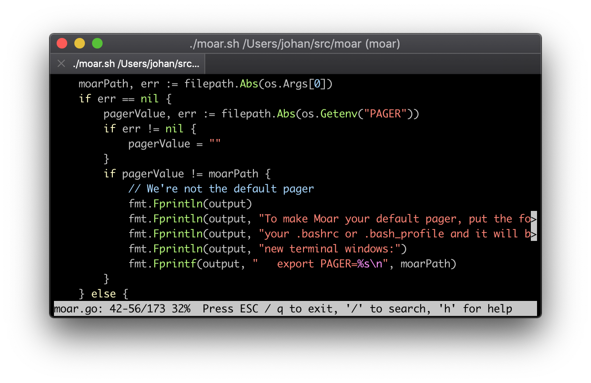

[](https://github.com/walles/moar/actions/workflows/linux-ci.yml?query=branch%3Amaster)
[](https://github.com/walles/moar/actions/workflows/windows-ci.yml?query=branch%3Amaster)

Moar is a pager. It reads and displays UTF-8 encoded text from files or
pipelines.

`moar` is designed to just do the right thing without any configuration:



The intention is that Moar should be trivial to get into if you have previously
been using [Less](http://www.greenwoodsoftware.com/less/). If you come from Less
and find Moar confusing or hard to migrate to, [please report
it](https://github.com/walles/moar/issues)!

Doing the right thing includes:

- **Syntax highlight** source code by default using
  [Chroma](https://github.com/alecthomas/chroma)
- **Search is incremental** / find-as-you-type just like in
  [Chrome](http://www.google.com/chrome) or
  [Emacs](http://www.gnu.org/software/emacs/)
- Search becomes case sensitive if you add any UPPER CASE characters
  to your search terms, just like in Emacs
- [Regexp](http://en.wikipedia.org/wiki/Regular_expression#Basic_concepts)
  search if your search string is a valid regexp
- Supports displaying ANSI color coded texts (like the output from
  `git diff` [| `riff`](https://github.com/walles/riff) for example)
- Supports UTF-8 input and output
- **Automatic decompression** when viewing [compressed text
  files](https://github.com/walles/moar/issues/97#issuecomment-1191415680)
  (`.gz`, `.bz2`, `.xz`, `.zst`, `.zstd`)
- The position in the file is always shown
- Supports **word wrapping** (on actual word boundaries) if requested using
  `--wrap` or by pressing <kbd>w</kbd>
- [**Follows output** as long as you are on the last line](https://github.com/walles/moar/issues/108#issuecomment-1331743242),
  just like `tail -f`
- Renders [terminal
  hyperlinks](https://gist.github.com/egmontkob/eb114294efbcd5adb1944c9f3cb5feda)
  properly
- **Mouse Scrolling** works out of the box (but
  [look here for tradeoffs](https://github.com/walles/moar/blob/master/MOUSE.md))

[For compatibility reasons](https://github.com/walles/moar/issues/14), `moar`
uses the formats declared in these environment variables if present:

- `LESS_TERMCAP_md`: Man page <b>bold</b>
- `LESS_TERMCAP_us`: Man page <u>underline</u>
- `LESS_TERMCAP_so`: [Status bar and search hits](https://github.com/walles/moar/issues/114)

For configurability reasons, `moar` reads extra command line options from the
`MOAR` environment variable.

Moar is used as the default pager by:

- [`px` / `ptop`](https://github.com/walles/px), `ps` and `top` for human beings
- [`riff`](https://github.com/walles/riff), a diff filter highlighting which line parts have changed

# Installing

## Using [Homebrew](https://brew.sh/)

```sh
brew install moar
```

Then whenever you want to upgrade to the latest release:

```sh
brew upgrade
```

## Using [MacPorts](https://www.macports.org/)

```sh
sudo port install moar
```

More info [here](https://ports.macports.org/port/moar/).

## Using [Gentoo](https://gentoo.org/)

```sh
emerge --ask --verbose sys-apps/moar
```

More info [here](https://packages.gentoo.org/packages/sys-apps/moar).

## Using [Arch Linux](https://archlinux.org/)

```sh
yay -S moar
```

More info [here](https://aur.archlinux.org/packages/moar-git).

## Manual Install

1. Download `moar` for your platform from
   <https://github.com/walles/moar/releases/latest>
1. `chmod a+x moar-*-*-*`
1. `sudo mv moar-*-*-* /usr/local/bin/moar`

And now you can just invoke `moar` from the prompt!

Try `moar --help` to see options.

If a binary for your platform is not available, please
[file a ticket](https://github.com/walles/moar/releases) or contact
<johan.walles@gmail.com>.

## Debian / Ubuntu

[A Request for Packaging is open](https://bugs.debian.org/cgi-bin/bugreport.cgi?bug=944035),
please help!

# Configuring

Do `moar --help` for an up to date list of options.

Environment variable `MOAR` can be used to set default options.

For example:

```bash
export MOAR='--statusbar=bold --no-linenumbers'
```

## Setting `moar` as your default pager

Set it as your default pager by adding...

```bash
export PAGER=/usr/local/bin/moar
```

... to your `.bashrc`.

# Issues

Issues are tracked [here](https://github.com/walles/moar/issues), or
you can send questions to <johan.walles@gmail.com>.

# Packaging

If you package `moar`, do include [the man page](moar.1) in your package.

# Embedding

Here's one way to embed `moar` in your app:

```go
package main

import (
	"bytes"
	"fmt"

	"github.com/walles/moar/m"
)

func main() {
	buf := new(bytes.Buffer)
	for range [99]struct{}{} {
		fmt.Fprintln(buf, "Moar")
	}

	err := m.NewPager(m.NewReaderFromStream("Moar", buf)).Page()
	if err != nil {
		// Handle paging problems
		panic(err)
	}
}
```

`m.Reader` can also be initialized using `NewReaderFromText()` or
`NewReaderFromFilename()`.

# Developing

You need the [go tools](https://golang.org/doc/install).

Run tests:

```bash
./test.sh
```

Launch the manual test suite:

```bash
./manual-test.sh
```

To run tests in 32 bit mode, either do `GOARCH=386 ./test.sh` if you're on
Linux, or `docker build . -f Dockerfile-test-386` (tested on macOS).

Run microbenchmarks:

```bash
go test -benchmem -run='^$' -bench=. . ./...
```

Profiling `BenchmarkPlainTextSearch()`. Try replacing `-alloc_objects` with
`-alloc_space` or change the `-focus` function:

```bash
go test -memprofilerate 1 -memprofile profile.out -benchmem -run='^$' -bench '^BenchmarkPlainTextSearch$' github.com/walles/moar/m && go tool pprof -alloc_objects -focus findFirstHit -relative_percentages -web profile.out
```

Build + run:

```bash
./moar.sh ...
```

Install (into `/usr/local/bin`) from source:

```bash
./install.sh
```

# Making a new Release

Make sure that [screenshot.png](screenshot.png) matches moar's current UI.
If it doesn't, scale a window to 81x16 characters and make a new one.

Execute `release.sh` and follow instructions.

# TODO

- Enable exiting using ^c (without restoring the screen).

- Start at a certain line if run as `moar file.txt:42`

- Handle search hits to the right of the right screen edge. Searching forwards
  should move first right, then to the left edge and down. Searching backwards
  should move first left, then up and to the right edge (if needed for showing
  search hits).

- Support viewing multiple files by pushing them in reverse order on the view
  stack.

- Retain the search string when pressing / to search a second time.

## Done

- Add `>` markers at the end of lines being cut because they are too long

- Doing moar on an arbitrary binary (like `/bin/ls`) should put all
  line-continuation markers at the rightmost column. This really means our
  truncation code must work even with things like tabs and various control
  characters.

- Make sure search hits are highlighted even when we have to scroll right
  to see them

- Change out-of-file visualization to writing `---` after the end of the file
  and leaving the rest of the screen blank.

- Exit search on pressing up / down / pageup / pagedown keys and
  scroll. I attempted to do that spontaneously, so it's probably a
  good idea.

- Remedy all FIXMEs in this README file

- Release the `go` version as the new `moar`, replacing the previous Ruby
  implementation

- Add licensing information (same as for the Ruby branch)

- Make sure `git grep` output gets highlighted properly.

- Handle all kinds of line endings.

- Make sure version information is printed if there are warnings.

- Add spinners while file is still loading

- Make `tail -f /dev/null` exit properly, fix
  <https://github.com/walles/moar/issues/7>.

- Showing unicode search hits should highlight the correct chars

- [Word wrap text rather than character wrap it](m/linewrapper.go).

- Arrow keys up / down while in line wrapping mode should scroll by screen line,
  not by input file line.

- Define 'g' to prompt for a line number to go to.
